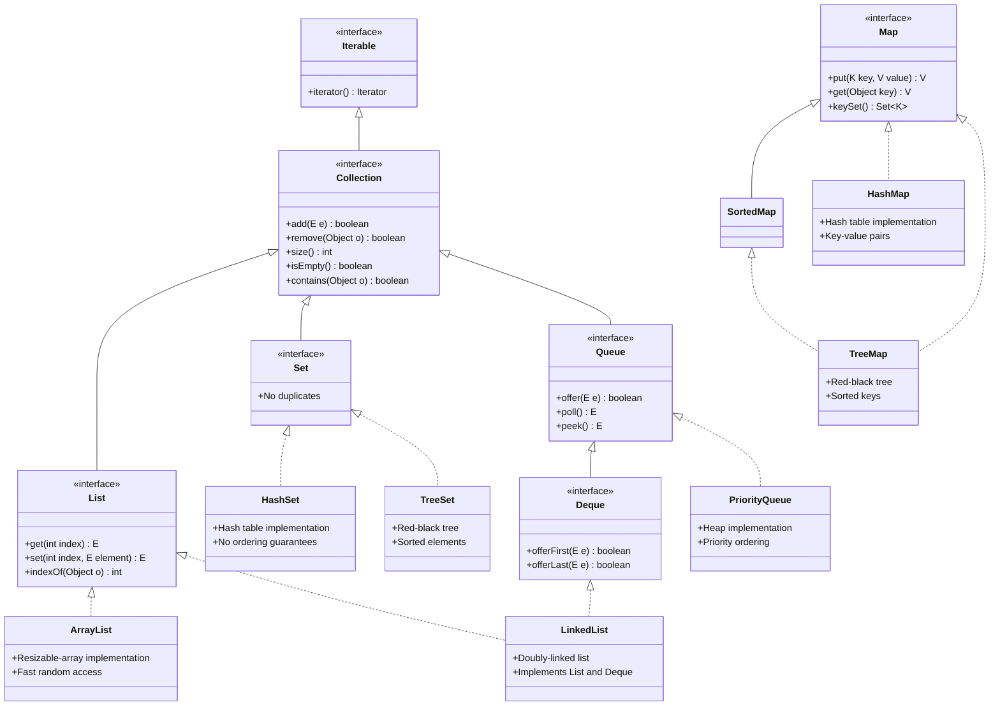

# Java Collections Framework: Complete Guide with Hierarchy

## Introduction to Java Collections

The Java Collections Framework (JCF) is a unified architecture for representing and manipulating collections of objects. It provides:

- Interfaces (abstract data types)
- Implementations (concrete classes)
- Algorithms (useful operations like searching and sorting)

## Mermaid Class Diagram of Java Collections Hierarchy



## Detailed Explanation of the Hierarchy

### 1. Root Interface: Iterable
- **Purpose**: Provides iterator capability
- **Key Method**: `iterator()`
- **All collection interfaces extend this**

### 2. Core Collection Interfaces

#### a) Collection Interface
- Root of the collection hierarchy
- Basic operations:
  - `add()`, `remove()`, `contains()`
  - `size()`, `isEmpty()`, `clear()`
- Three main sub-interfaces: List, Set, Queue

#### b) List Interface
- **Characteristics**:
  - Ordered collection (sequence)
  - Allows duplicates
  - Positional access
- **Key Methods**:
  - `get(int index)`, `set(int index, E element)`
  - `indexOf(Object o)`, `subList()`
- **Implementations**:
  - `ArrayList`: Resizable array
  - `LinkedList`: Doubly-linked list
  - `Vector`: Legacy synchronized version

#### c) Set Interface
- **Characteristics**:
  - No duplicates
  - No positional access
- **Implementations**:
  - `HashSet`: Hash table (fastest)
  - `LinkedHashSet`: Maintains insertion order
  - `TreeSet`: Red-black tree (sorted)

#### d) Queue Interface
- **Characteristics**:
  - FIFO (First-In-First-Out) typically
  - Specialized for holding elements prior to processing
- **Implementations**:
  - `PriorityQueue`: Priority heap
  - `LinkedList`: Also implements Deque
  - `ArrayDeque`: Resizable array implementation

#### e) Deque Interface (Double Ended Queue)
- **Characteristics**:
  - Supports insertion/removal at both ends
  - Can function as both queue and stack
- **Implementations**:
  - `ArrayDeque`: Resizable array
  - `LinkedList`: Doubly-linked list

### 3. Map Interface Hierarchy (Separate from Collection)

- **Characteristics**:
  - Stores key-value pairs
  - Keys are unique
- **Implementations**:
  - `HashMap`: Hash table implementation
  - `LinkedHashMap`: Maintains insertion order
  - `TreeMap`: Red-black tree (sorted keys)
  - `Hashtable`: Legacy synchronized version

## Key Implementation Classes

### List Implementations

1. **ArrayList**
   - Resizable array implementation
   - Fast random access (O(1))
   - Slow insertions/deletions in middle (O(n))
   - Default initial capacity: 10
   - Grows by 50% when full

2. **LinkedList**
   - Doubly-linked list implementation
   - Fast insertions/deletions (O(1))
   - Slow random access (O(n))
   - Implements both List and Deque

### Set Implementations

1. **HashSet**
   - Backed by HashMap
   - Constant-time operations (O(1))
   - No ordering guarantees
   - Allows one null element

2. **TreeSet**
   - Red-black tree implementation
   - Elements sorted (natural ordering or Comparator)
   - O(log n) operations
   - No null elements if natural ordering used

### Queue Implementations

1. **PriorityQueue**
   - Priority heap implementation
   - Orders elements according to natural ordering or Comparator
   - O(log n) time for enqueuing/dequeuing
   - No null elements

### Map Implementations

1. **HashMap**
   - Hash table implementation
   - O(1) average time for get/put
   - No ordering guarantees
   - Allows one null key and multiple null values

2. **TreeMap**
   - Red-black tree implementation
   - Keys sorted (natural ordering or Comparator)
   - O(log n) time for operations
   - No null keys if natural ordering used

## Collection Algorithms

The `Collections` utility class provides static methods for common operations:

- Sorting: `sort()`, `reverse()`
- Searching: `binarySearch()`
- Shuffling: `shuffle()`
- Synchronization: `synchronizedList()`, `synchronizedSet()`
- Immutability: `unmodifiableList()`, `unmodifiableSet()`

## Thread Safety Considerations

Most collection implementations are **not thread-safe** by default. Options for thread safety:

1. Use synchronized wrappers:
   ```java
   List<String> syncList = Collections.synchronizedList(new ArrayList<>());
   ```

2. Use concurrent collections from `java.util.concurrent`:
   - `ConcurrentHashMap`
   - `CopyOnWriteArrayList`
   - `BlockingQueue` implementations

3. Use legacy classes (not recommended):
   - `Vector` (synchronized ArrayList)
   - `Hashtable` (synchronized HashMap)

## Performance Characteristics

| Collection | Get | Add | Contains | Next | Notes |
|------------|-----|-----|----------|------|-------|
| ArrayList | O(1) | O(1) | O(n) | O(1) | Amortized O(1) add |
| LinkedList | O(n) | O(1) | O(n) | O(1) | Fast add/remove at ends |
| HashSet | O(1) | O(1) | O(1) | O(h/n) | h = table capacity |
| TreeSet | O(log n) | O(log n) | O(log n) | O(log n) | Sorted elements |
| HashMap | O(1) | O(1) | O(1) | O(h/n) | h = table capacity |
| TreeMap | O(log n) | O(log n) | O(log n) | O(log n) | Sorted keys |

## Best Practices

1. **Choose the right collection**:
   - Need ordering? Use List or LinkedHashSet
   - Need uniqueness? Use Set
   - Need key-value pairs? Use Map
   - Need thread-safety? Use concurrent collections

2. **Initialize with proper capacity** for large collections:
   ```java
   new ArrayList<>(1000); // Avoids resizing
   ```

3. **Use immutable collections** when possible:
   ```java
   List<String> immutable = List.of("a", "b", "c");
   ```

4. **Prefer interfaces** in method signatures:
   ```java
   public void processItems(List<String> items) {...}
   ```

The Java Collections Framework provides a powerful, flexible set of tools for managing groups of objects. Understanding the hierarchy and characteristics of each implementation helps in selecting the most appropriate collection for any given task.
