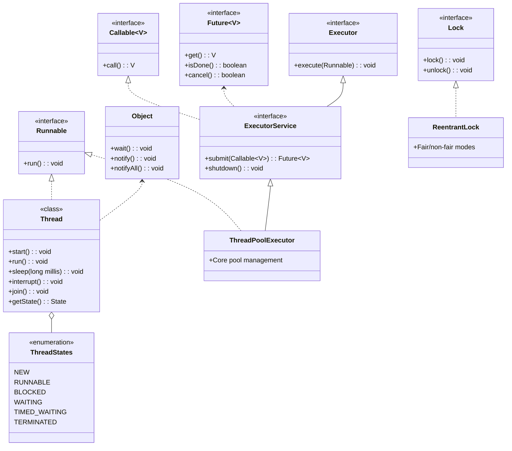
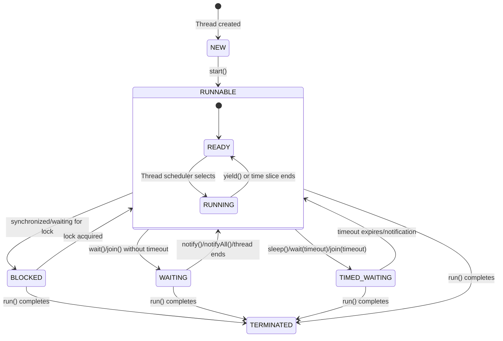

# Java Threading: Complete Guide with Diagrams

## Introduction to Java Threading

Java threading allows concurrent execution of program segments. The Java threading model is built on:

1. **Thread Class** - Basic thread unit
2. **Runnable Interface** - Task abstraction
3. **Thread States** - Lifecycle management
4. **Synchronization** - Thread coordination
5. **Thread Pools** - Efficient resource management

## Mermaid Diagram: Java Threading Architecture



## Detailed Thread Lifecycle (State Diagram)



## Core Threading Components Explained

### 1. Thread Creation

**Two approaches**:
1. Extend `Thread` class:
```java
class MyThread extends Thread {
    public void run() {
        // Task logic
    }
}
new MyThread().start();
```

2. Implement `Runnable`:
```java
class MyTask implements Runnable {
    public void run() {
        // Task logic
    }
}
new Thread(new MyTask()).start();
```

**Java 8+ Lambda syntax**:
```java
new Thread(() -> {
    // Task logic
}).start();
```

### 2. Thread States

1. **NEW**: Created but not started
2. **RUNNABLE**: Ready to run or running
3. **BLOCKED**: Waiting for monitor lock
4. **WAITING**: Indefinitely waiting (no timeout)
5. **TIMED_WAITING**: Waiting with timeout
6. **TERMINATED**: Execution completed

### 3. Thread Synchronization

**a) Synchronized Methods/Blocks**:
```java
public synchronized void method() {
    // Thread-safe code
}

// OR
synchronized(lockObject) {
    // Thread-safe code
}
```

**b) Lock Objects** (java.util.concurrent.locks):
```java
Lock lock = new ReentrantLock();
lock.lock();
try {
    // Critical section
} finally {
    lock.unlock();
}
```

### 4. Thread Communication

**Wait/Notify Mechanism**:
```java
synchronized(sharedObject) {
    while(conditionNotMet) {
        sharedObject.wait();
    }
    // Proceed with work
    sharedObject.notifyAll();
}
```

### 5. Thread Pools (Executor Framework)

**Key Interfaces**:
1. `Executor` - Basic execute() capability
2. `ExecutorService` - Extended management
3. `ScheduledExecutorService` - Delayed/periodic execution

**Common Implementations**:
```java
// Fixed thread pool
ExecutorService pool = Executors.newFixedThreadPool(4);

// Submit tasks
Future<String> future = pool.submit(() -> {
    return "Task result";
});

// Shutdown properly
pool.shutdown();
```

## Threading Best Practices

1. **Prefer Runnable over Thread**:
   - More flexible (can extend other classes)
   - Better for thread pools

2. **Use Thread Pools**:
   - Avoids expensive thread creation overhead
   - Manages resources efficiently

3. **Proper Synchronization**:
   - Synchronize the smallest critical sections possible
   - Document thread-safety guarantees

4. **Avoid Deadlocks**:
   - Always acquire locks in consistent order
   - Use timeout mechanisms:
     ```java
     if (lock.tryLock(1, TimeUnit.SECONDS)) {
         try { /* ... */ } finally { lock.unlock(); }
     }
     ```

5. **Volatile for Visibility**:
   ```java
   private volatile boolean running = true;
   ```
   Ensures changes are visible across threads

6. **Prefer Concurrent Collections**:
   - `ConcurrentHashMap`
   - `CopyOnWriteArrayList`
   - `BlockingQueue` implementations

## Common Threading Patterns

### Producer-Consumer Pattern
```java
BlockingQueue<Item> queue = new LinkedBlockingQueue<>();

// Producer
queue.put(item);

// Consumer
Item item = queue.take();
```

### Worker Thread Pattern
```java
ExecutorService workers = Executors.newFixedThreadPool(10);
while (hasTasks()) {
    workers.submit(this::processTask);
}
workers.shutdown();
```

### Fork-Join Framework (Java 7+)
```java
class MyTask extends RecursiveTask<Integer> {
    protected Integer compute() {
        if (problemSmallEnough) {
            return solveDirectly();
        } else {
            MyTask left = new MyTask(part1);
            MyTask right = new MyTask(part2);
            left.fork();
            return right.compute() + left.join();
        }
    }
}
```

## Threading Pitfalls to Avoid

1. **Race Conditions**:
   - When outcome depends on thread timing
   - Fix: Proper synchronization

2. **Deadlocks**:
   - Circular wait for locks
   - Fix: Lock ordering/timeouts

3. **Livelocks**:
   - Threads keep responding but make no progress
   - Fix: Introduce randomness in retries

4. **Thread Leaks**:
   - Forgetting to shutdown thread pools
   - Fix: Always use try-with-resources or finally blocks

5. **Memory Consistency Errors**:
   - Different threads see different values
   - Fix: Proper synchronization or volatile

## Advanced Threading Concepts

### 1. ThreadLocal
```java
private static final ThreadLocal<SimpleDateFormat> formatter =
    ThreadLocal.withInitial(() -> new SimpleDateFormat("yyyy-MM-dd"));
```
- Provides thread-specific storage

### 2. Atomic Variables
```java
AtomicInteger counter = new AtomicInteger(0);
counter.incrementAndGet();
```
- Lock-free thread-safe operations

### 3. CompletableFuture (Java 8+)
```java
CompletableFuture.supplyAsync(() -> fetchData())
    .thenApply(data -> process(data))
    .thenAccept(result -> use(result));
```
- Asynchronous programming with chaining

## Performance Considerations

1. **Context Switching**:
   - Expensive operation when threads > cores
   - Minimize with proper pool sizing

2. **False Sharing**:
   - When unrelated data shares cache lines
   - Fix: Padding or `@Contended` (Java 8)

3. **Lock Contention**:
   - Many threads competing for same lock
   - Fix: Reduce lock granularity or use lock-free structures

## Monitoring Threads

**Thread Dump**:
1. Command line: `jstack <pid>`
2. Programmatic:
```java
Thread.getAllStackTraces().forEach((thread, stack) -> {
    System.out.println(thread.getName());
    for (StackTraceElement element : stack) {
        System.out.println("\t" + element);
    }
});
```

Java's threading model provides powerful concurrency capabilities when used properly. Understanding the lifecycle, synchronization mechanisms, and higher-level abstractions is key to building efficient, thread-safe applications.
